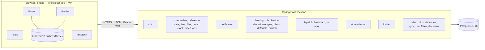

# Architecture

Waypoint Relay is one React app and one Spring Boot backend backed by one PostgreSQL database. The backend is a modular monolith: modules by area, not microservices.



## Modules

All modules live under `backend/src/main/java/com/synapse/waypoint/` and share the same layering: controller → service → repository → entity. Controllers are thin, API responses are DTO records, and a module reaches another only through that module's public service, never its repositories.

| Module | Responsibility |
|---|---|
| `common` | Error format, security configuration, `CurrentUser`, `DemoClock` |
| `auth` | Login (email + password, staff ID + PIN, depot + PIN), JWT issue, `/api/auth/me` |
| `core` | `OrderService` (the only place an order's status changes), close orders, outlets, vehicles and fleet availability, files, settings and demo clock, timed jobs, seed loader |
| `notification` | `NotificationService`, the notification list and read state |
| `planning` | `PlanningEngine`, rule checker, plan persistence, deferrals and the store's answer to them, publish |
| `dispatch` | Live board aggregate and run report |
| `store`, `issue` | Store endpoints (orders, deliveries, receipt, failed-delivery answer) and issues |
| `loader` | Loading lists, fridge check, load ticks, shortfalls, handover |
| `driver` | Today's trips, delivery outcomes, vehicle problems, `POST /api/sync`, proof files, dispatcher decisions on failures and conflicts |

Public service interfaces other modules call: `OrderService`, `ReferenceService`, `NotificationService`, `PlanQueryService`, `DeliveryQueryService`, `DispatchDecisionService`, `LoadingQueryService`. The endpoint contract is in [`api.md`](api.md); tables are in [`data-model.md`](data-model.md).

## Security

Spring Security runs as an OAuth2 resource server with HS256 JWTs (`JWT_SECRET`). Passwords and PINs are stored as BCrypt hashes. Path rules:

| Path | Role |
|---|---|
| `/api/store/**` | Store manager |
| `/api/dispatch/**`, `POST /api/settings/clock` | Dispatcher |
| `/api/loader/**` | Loader |
| `/api/driver/**` | Driver |
| `/api/sync` | Driver or loader |
| `/api/auth/login`, `GET /api/settings` | Public |
| everything else | Any signed-in user |

Data scope is enforced in services through `CurrentUser`: a store sees its own outlet, a driver its own vehicle, a loader its own depot. Another scope's record answers 404, so existence is not revealed.

## Order lifecycle

`OrderStatus` defines its own allowed transitions, and `OrderService` is the only code that changes a status. Each change writes an `order_events` row in the same transaction and publishes an `OrderStatusChanged` event (the store module listens to it for notifications). An invalid change returns 409 `INVALID_STATUS`.

```
PREPARED → CONFIRMED → PLANNED → LOADED → ON_THE_WAY → DELIVERED | PARTIAL | FAILED
                    ↘ MOVED (deferred, same order, new date)      FAILED → MOVED | CANCELLED
                    ↘ CANCELLED
```

## Demo clock and timed jobs

Business time comes from `DemoClock` (real time plus an offset), never the machine clock. A dispatcher can move it (`POST /api/settings/clock`); moving it runs any job that has become due. A scheduler also ticks every 30 seconds. Each job runs once per run and depot.

| Demo time (Sri Lanka) | Job |
|---|---|
| 3:00 PM, day before the run | Reminder to stores with unconfirmed chilled, Style or Tech orders |
| 3:30 PM | Alert to dispatch listing stores that have not confirmed |
| 4:00 PM | Close orders (Fresh ambient auto-confirmed; other unconfirmed orders left out) |
| 2:00 PM, run day | Failed deliveries nobody answered are re-planned for the next day |
| 11:59 PM, run day | Unconfirmed receipts close automatically |

## Planning engine

`PlanningEngine` is pure and deterministic: the same orders, fleet and run date always produce the same plan.

1. **Priority** (`PriorityScorer`): chilled Fresh 3, ambient Fresh 2, Style and Tech 1, plus 2 for each extra day waited and 3 if deferred yesterday.
2. **Allocation** (`Allocator`, `MultiStartAllocator`): a greedy allocator runs several times with different tie-breaking and keeps the best result; run 0 is the plain run, so the answer is never worse than it.
3. **Deferral analysis** (`DeferralAnalyzer`): every order left out gets a kind (`UNAVOIDABLE` when no vehicle can carry it, `CHOSEN` when it lost on priority), the rule that decided it, a plain-language reason and a new date.
4. **Verification** (`RuleChecker`): the finished plan is re-checked by the same hard rules the allocator uses: one brand and district per trip, fridge vehicles for chilled orders, van-only outlets, home depot, weight and volume capacity, at most two trips per vehicle, trip time budgets, weekly fuel quota and delivery windows. Late arrivals are reported as warnings. Violations are counted in the plan summary, and the dispatcher's Publish button is disabled while there is one.
5. **Arrival windows** (`ArrivalEstimator`): predicted from the trip-time formula, with a late-risk value per stop.

Publishing is one transaction: placed orders become `PLANNED`, deferred orders `MOVED` to their new date, and stores, loaders and drivers are notified.

## Loading, delivery and offline operation

- Loaders see published trips for their depot, run the fridge check, load in reverse stop order, flag shortfalls (which create a remainder order ending in `-R`) and hand over to the driver.
- A driver's actions are saved on the phone first, in an IndexedDB outbox with a unique `clientId`, then sent to `POST /api/sync` when there is signal. The server stores each `clientId` once, so a retry is never applied twice. Today's trips and stops are downloaded at sign-in and the PWA caches the app, so a run continues with no signal. Screens show the sync state: Synced, Syncing, Offline or N waiting. Details: [`driver-outbox_sync.md`](driver-outbox_sync.md).
- **Physical facts win** on conflict: a delivery recorded with proof stands, and the dispatcher gets one decision card (Driver decisions).
- Photos and signatures are stored in the database `files` table and served from `/api/files/{id}`.
- A failed delivery gets a decision from the dispatcher or from the store (`DispatchDecisionService.decideFailedDelivery`). A decided failure is skipped by the 2 PM job.

## Frontend

React 19, TypeScript (strict), Vite, Tailwind CSS 4, React Router 7 and TanStack Query. Each role has its own route tree and layout behind a role guard (`/store`, `/dispatch`, `/loader`, `/driver`). Server data goes through one API client in `src/lib/api`, and live screens poll (15 seconds for most live data, 30 seconds for the rest) rather than use websockets. Text is in English, Sinhala and Tamil. Times are stored in UTC and shown in Sri Lanka time, 12-hour format.

## Data and deployment

Flyway migrations (`backend/src/main/resources/db/migration`) own the schema and Hibernate only validates it. The competition dataset is never committed: the seed loader reads it from `DATA_DIR` on first start, once. The frontend is deployed on Vercel; the backend runs with Docker Compose behind Caddy for HTTPS. See [`deployment.md`](deployment.md) and the decision records in [`adr/`](adr/).
