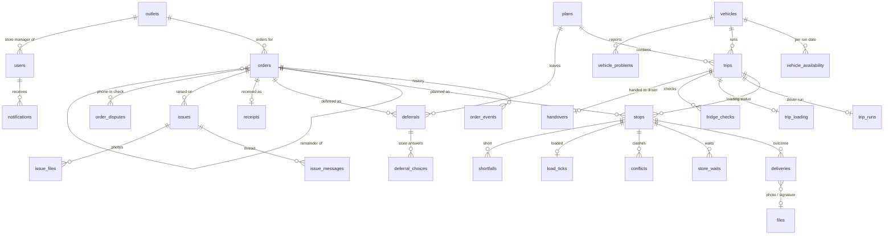

# Data model

One PostgreSQL 16 database shared by all backend modules. The schema is created only by Flyway migrations
(`backend/src/main/resources/db/migration`); Hibernate validates against it (`ddl-auto=validate`).

## Rules

- Each module owns its tables and writes them only in its own migration range (see `CONTRIBUTING.md`).
- A module reads or changes another module's data **only through that module's service** (`docs/api.md` §11).
  Foreign keys across modules are allowed; queries across modules are not.
- Lower ranges never reference higher ranges, so migrations always apply in order:
  core (V1–V9) → planning (V10–V19) → driver (V20–V29) → store/issue (V30–V39) → dispatch (V40–V49) → loader (V50–V59).
- IDs are `VARCHAR(40)` strings (UUID strings for generated rows; reference data keeps its own IDs such as `OUT001`).
- Enumerations are `VARCHAR` + `CHECK`, values as in `docs/api.md`.
- Timestamps are `TIMESTAMPTZ` (UTC) taken from the demo clock; dates are `DATE`; outlet windows are `TIME`.
- Rows changed by more than one user carry `version INTEGER NOT NULL DEFAULT 0` (optimistic locking).
- Requests replayed from offline devices carry a unique `client_id`, so applying them twice has no effect.

## Overview

---

## Core, auth, notifications (V1–V9)

### Done — `V1__core.sql`
`outlets`, `vehicles`, `district_travel`, `service_allowance`, `users`, `vehicle_availability`, `fuel_usage`,
`order_runs`, `orders`, `order_events`, `app_settings`. See the migration for every column.

Key columns other modules use:

| Table | Columns |
|---|---|
| `orders` | `id`, `ref`, `outlet_id`, `brand`, `temp_requirement` (CHILLED/AMBIENT), `units`, `weight_kg`, `volume_m3`, `run_date`, `status`, `source`, `parent_order_id` |
| `users` | `id`, `name`, `role`, `outlet_id`, `depot`, `vehicle_id`, `staff_id` |
| `vehicles` | `id`, `type` (truck/van), `temp` (reefer/ambient), `weight_cap_kg`, `volume_cap_m3`, `depot` |
| `outlets` | `id`, `brand`, `district`, `depot`, `dock_type`, `parking_constraint`, windows |

### `V2__notifications.sql`

**notifications** — one row per recipient (a role-wide message is copied to each user, so read state is per user).

| Column | Type | Notes |
|---|---|---|
| id | VARCHAR(40) PK | |
| user_id | VARCHAR(40) NOT NULL → users | recipient |
| severity | VARCHAR(10) | CRITICAL · WARNING · INFO |
| type | VARCHAR(40) | e.g. DELIVERY_FAILED, CUTOFF_REMINDER |
| title | VARCHAR(200) | |
| body | TEXT | |
| link | VARCHAR(200) | frontend route |
| created_at | TIMESTAMPTZ | |
| read_at | TIMESTAMPTZ NULL | |

Index: `(user_id, read_at, created_at DESC)`.

### `V3__files.sql`

**files** — proof photos, signatures and issue photos, stored in the database so the backend stays stateless.
Owned by core; other modules use `FileService`.

| Column | Type | Notes |
|---|---|---|
| id | VARCHAR(40) PK | `f-<uuid>` |
| kind | VARCHAR(20) | PHOTO · SIGNATURE |
| content_type | VARCHAR(60) | image/jpeg, image/png, image/webp |
| size_bytes | INTEGER | ≤ 10 MB (resize on the device) |
| data | BYTEA | |
| client_id | VARCHAR(40) UNIQUE NULL | offline uploads |
| uploaded_by | VARCHAR(40) → users | |
| created_at | TIMESTAMPTZ | |

---

## Planning (V10–V19) — `V10__planning.sql`

**plans** — one row per version; a revision creates a new version and supersedes the old one.

| Column | Type | Notes |
|---|---|---|
| id | VARCHAR(40) PK | |
| run_date | DATE | |
| depot | VARCHAR(20) | |
| version | INTEGER | 1, 2, … · UNIQUE (run_date, depot, version) |
| status | VARCHAR(20) | DRAFT · PUBLISHED · SUPERSEDED |
| summary | JSONB | served, deferred, unavoidable, chosen, violations, fridge use |
| parent_plan_id | VARCHAR(40) NULL → plans | previous version |
| revise_reason | TEXT NULL | |
| created_at / created_by | TIMESTAMPTZ / → users | |
| published_at / published_by | TIMESTAMPTZ NULL / → users | |
| version_lock | INTEGER DEFAULT 0 | optimistic locking |

**trips**

| Column | Type | Notes |
|---|---|---|
| id | VARCHAR(40) PK | |
| plan_id | → plans | |
| vehicle_id | → vehicles | |
| trip_no | SMALLINT | 1 or 2 · UNIQUE (plan_id, vehicle_id, trip_no) |
| brand | VARCHAR(10) | one brand per trip |
| district | VARCHAR(40) | one district per trip |
| window_type | VARCHAR(10) | FRESH (pre-dawn, 270 min) · DAYTIME (480 min) |
| depart_at | TIMESTAMPTZ | |
| minutes | INTEGER | planned trip time |
| weight_kg / volume_m3 | NUMERIC | totals |
| km | NUMERIC(8,2) | for fuel |

**stops**

| Column | Type | Notes |
|---|---|---|
| id | VARCHAR(40) PK | |
| trip_id | → trips | |
| order_id | → orders | index |
| seq | SMALLINT | delivery order · UNIQUE (trip_id, seq) |
| load_seq | SMALLINT | loading order (reverse of delivery) |
| arrive_from / arrive_to | TIMESTAMPTZ | arrival window shown to the store |
| late_risk | NUMERIC(4,3) | 0–1 |

**deferrals**

| Column | Type | Notes |
|---|---|---|
| id | VARCHAR(40) PK | |
| plan_id | → plans | |
| order_id | → orders | |
| kind | VARCHAR(20) | UNAVOIDABLE · CHOSEN |
| rule | VARCHAR(30) | RuleCode from `docs/api.md` |
| reason | TEXT | plain-language reason |
| priority_score | INTEGER | |
| days_waited | INTEGER | |
| new_date | DATE | |
| needs_decision | BOOLEAN | store must choose |

**deferral_choices**

| Column | Type | Notes |
|---|---|---|
| id | VARCHAR(40) PK | |
| deferral_id | → deferrals | |
| choice | VARCHAR(10) | KEEP · REDUCE · CANCEL · SPLIT |
| units | INTEGER NULL | for REDUCE / SPLIT |
| chosen_by | → users | |
| chosen_at | TIMESTAMPTZ | |

---

## Driver (V20–V29) — `V20__driver.sql`

**trip_runs** — the driver's side of a trip.

| Column | Type | Notes |
|---|---|---|
| trip_id | VARCHAR(40) PK → trips | |
| driver_id | → users | |
| accepted_at | TIMESTAMPTZ NULL | R0 accept load |
| started_at / ended_at | TIMESTAMPTZ NULL | |
| last_sync_at | TIMESTAMPTZ NULL | shown on the live board |

**deliveries**

| Column | Type | Notes |
|---|---|---|
| id | VARCHAR(40) PK | |
| stop_id | → stops | |
| order_id | → orders | |
| vehicle_id | → vehicles | |
| outcome | VARCHAR(20) | DELIVERED · PARTIAL · FAILED |
| units | INTEGER | delivered units |
| reason | VARCHAR(30) NULL | for PARTIAL/FAILED, e.g. STORE_CLOSED, NO_ACCESS, REFUSED, DAMAGED |
| received_by | VARCHAR(100) NULL | |
| photo_file_id / signature_file_id | → files NULL | |
| arrived_at / completed_at | TIMESTAMPTZ | |
| recorded_by | → users | |
| client_id | VARCHAR(40) UNIQUE | |
| undone_at | TIMESTAMPTZ NULL | DELIVERY_UNDONE |
| decision | VARCHAR(20) NULL | failed only: REPLAN_TOMORROW · TRY_LATER_TODAY · CANCEL |
| decided_by / decided_at | → users / TIMESTAMPTZ NULL | dispatcher decision |
| store_choice / store_choice_at | VARCHAR(20) / TIMESTAMPTZ NULL | store's preference |

One active delivery per stop: unique index on `stop_id` where `undone_at IS NULL`.

**store_waits** — id, stop_id → stops, started_at, ended_at, minutes, note, client_id UNIQUE.

**vehicle_problems**

| Column | Type | Notes |
|---|---|---|
| id | VARCHAR(40) PK | |
| vehicle_id / trip_id | → vehicles / → trips NULL | |
| kind | VARCHAR(20) | BREAKDOWN · FRIDGE_FAULT · ACCIDENT · TYRE · OTHER |
| can_drive | BOOLEAN | |
| fridge_temp_c | NUMERIC(4,1) NULL | |
| note | TEXT | |
| status | VARCHAR(20) | OPEN · RESOLVED |
| reply | TEXT NULL | dispatcher reply (R9ok) |
| reported_by / reported_at | → users / TIMESTAMPTZ | |
| replied_by / replied_at | → users / TIMESTAMPTZ NULL | |
| client_id | VARCHAR(40) UNIQUE | |

**sync_log** — client_id VARCHAR(40) PK, user_id → users, type VARCHAR(30), result VARCHAR(20) (APPLIED · DUPLICATE · CONFLICT), entity_id VARCHAR(40) NULL, received_at.

**conflicts**

| Column | Type | Notes |
|---|---|---|
| id | VARCHAR(40) PK | |
| stop_id / order_id | → stops / → orders | |
| delivery_id | → deliveries NULL | the field record that won |
| details | JSONB | what clashed |
| status | VARCHAR(20) | OPEN · RESOLVED |
| resolution | VARCHAR(20) NULL | KEEP_FIELD · OVERRIDE |
| resolved_by / resolved_at | → users / TIMESTAMPTZ NULL | |
| created_at | TIMESTAMPTZ | |

**returns** — id, trip_id → trips, order_id → orders, units, reason VARCHAR(30), recorded_by → users, recorded_at.

---

## Store and issues (V30–V39) — `V30__store.sql`

**receipts**

| Column | Type | Notes |
|---|---|---|
| id | VARCHAR(40) PK | |
| order_id | → orders UNIQUE | |
| received_units | INTEGER | |
| note | TEXT NULL | |
| received_by | → users NULL | NULL when auto-closed |
| received_at | TIMESTAMPTZ | |
| auto_closed | BOOLEAN DEFAULT FALSE | end-of-day job |

**issues**

| Column | Type | Notes |
|---|---|---|
| id | VARCHAR(40) PK | |
| ref | VARCHAR(20) UNIQUE | e.g. ISS-0001 |
| outlet_id / order_id | → outlets / → orders NULL | |
| type | VARCHAR(20) | DAMAGED · MISSING · WRONG_ITEM · LATE · OTHER |
| units | INTEGER NULL | |
| wants | VARCHAR(20) | REPLACE · CREDIT · NOTHING |
| status | VARCHAR(20) | OPEN · ANSWERED · RESOLVED |
| created_by / created_at | → users / TIMESTAMPTZ | |
| resolved_by / resolved_at | → users / TIMESTAMPTZ NULL | |
| version | INTEGER DEFAULT 0 | |

**issue_messages** — id, issue_id → issues, author_id → users, text TEXT, created_at.

**issue_files** — issue_id → issues, file_id → files, PK (issue_id, file_id).

**order_disputes** — a store's answer when checking a phone-in order (S2e-msg): id, order_id → orders, outlet_id → outlets, message TEXT, status VARCHAR(20) (OPEN · RESOLVED), created_by → users, created_at, resolved_at NULL.

---

## Dispatch (V40–V49)

No tables. The live board, reports and capacity view are read from the other modules' services.
Add a table here only if a report needs stored snapshots.

---

## Loader (V50–V59) — `V50__loader.sql`

**trip_loading**

| Column | Type | Notes |
|---|---|---|
| trip_id | VARCHAR(40) PK → trips | |
| status | VARCHAR(20) | WAITING · LOADING · READY · LOADED · DEPARTED |
| loaded_by | → users NULL | |
| loaded_at | TIMESTAMPTZ NULL | |
| updated_at | TIMESTAMPTZ | |

**fridge_checks** — id, trip_id → trips, running BOOLEAN, temp_c NUMERIC(4,1), doors_ok BOOLEAN, passed BOOLEAN (running AND 0–5 °C AND doors_ok), checked_by → users, checked_at.

**load_ticks** — stop_id VARCHAR(40) PK → stops, ticked_by → users, ticked_at.

**shortfalls**

| Column | Type | Notes |
|---|---|---|
| id | VARCHAR(40) PK | |
| stop_id / order_id | → stops / → orders | |
| missing_units | INTEGER | > 0 |
| reason | VARCHAR(20) | MISSING · DAMAGED · WRONG_ITEM |
| note | TEXT NULL | |
| remainder_order_id | → orders | created by `OrderService.createRemainder` |
| reported_by / reported_at | → users / TIMESTAMPTZ | |

**handovers** — id, trip_id → trips UNIQUE, driver_id → users, loader_id → users, cases INTEGER, weight_kg NUMERIC(10,2), at TIMESTAMPTZ.

---

## Who changes what

| Data | Written by | Everyone else |
|---|---|---|
| `orders.status`, `order_events` | `OrderService` only | calls `OrderService` |
| plans, trips, stops, deferrals | planning | `PlanQueryService` |
| deliveries, conflicts, problems | driver | `DeliveryQueryService` |
| loading, shortfalls | loader | `LoadingQueryService` |
| notifications | `NotificationService` | calls `NotificationService` |
| files | `FileService` | calls `FileService` |
